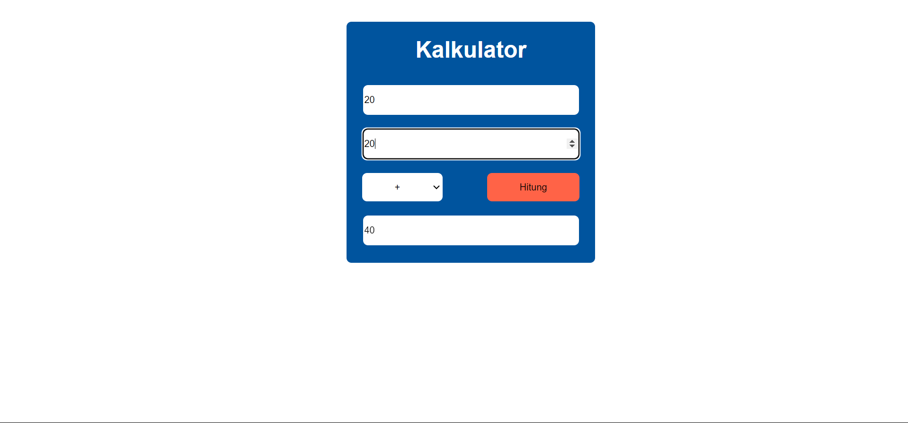

# Kalkulator #

Aplikasi kalkulator ini simpel banget, dibuat buat ngitung-ngitung angka kayak penjumlahan, pengurangan, perkalian, sama pembagian. Dengan tampilan yang sederhana dan mudah dipakai, kamu bisa langsung masukin angka dan ngeliat hasil perhitungannya dengan cepat. Dibikin pakai teknologi dasar kayak HTML, CSS, dan PHP (atau bahasa lain kalau diperlukan), aplikasi ini cocok buat dipakai sehari-hari buat hitungan basic. Pokoknya gampang, cepat, dan praktis!